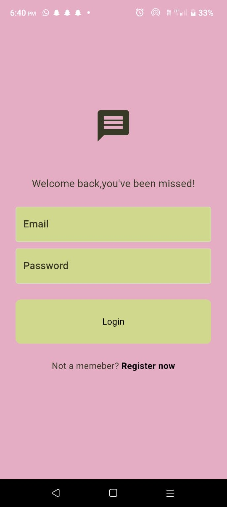
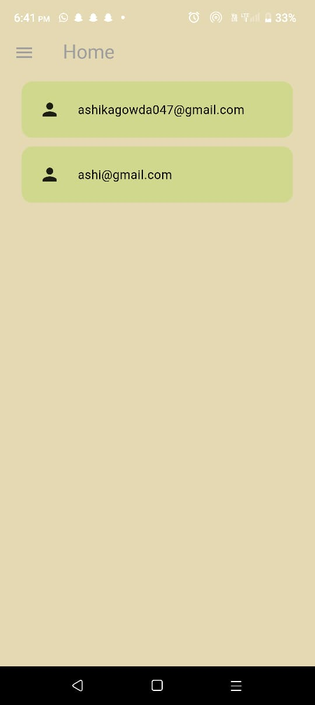
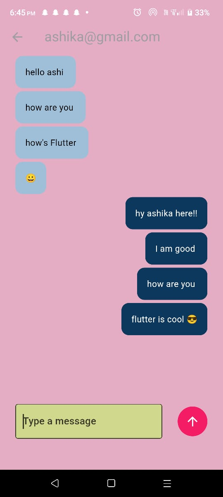
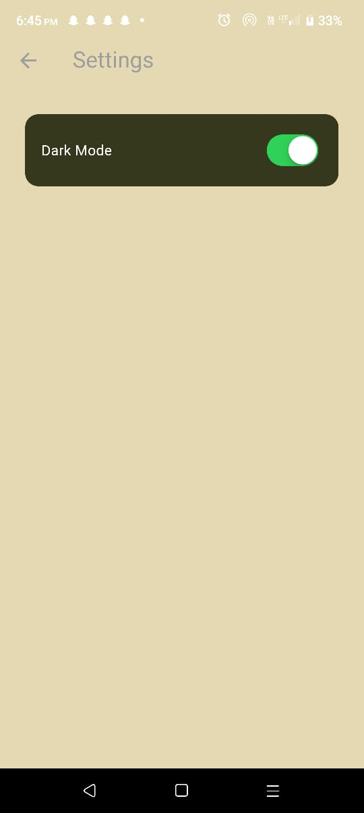
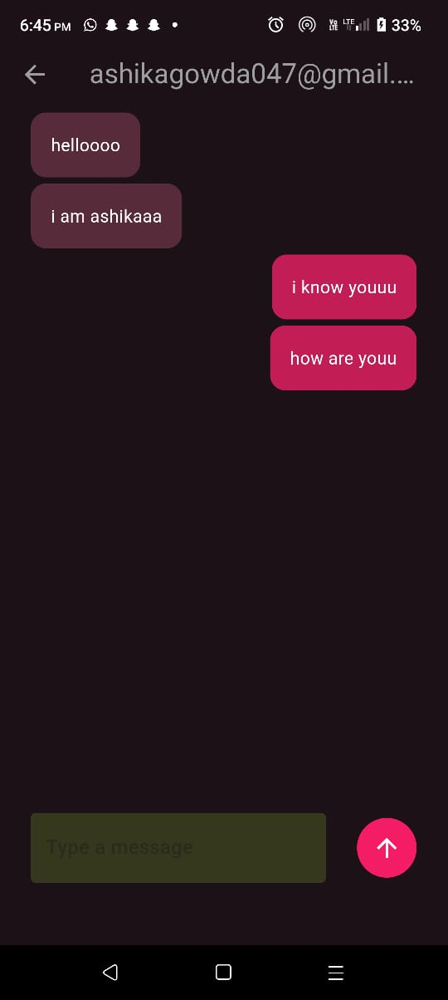

 








# 💬 Chat Application

A real-time messaging app built using Flutter and Firebase.  
It allows users to sign up, log in, and chat instantly.  
Messages are stored in Firebase Firestore 
The UI is simple, clean, and mobile-friendly.  
Great for learning how Firebase works with Flutter in real-world apps.  
It also includes user authentication and message sync.  
---

## ✨ Features

- 🔐 User Authentication (Sign Up & Log In)
- 💬 Real-time messaging
- 📄 Messages saved to Firestore
- 🌓 Light & dark mode support
- 🧑‍🤝‍🧑 Simple and clean user interface

---

## ⚙️ Technology Used

- **Flutter**  
- **Dart**  
- **Firebase Authentication**  
- **Cloud Firestore**  
- **Provider / StreamBuilder (for state updates)**

---

## 📦 Prerequisites

Make sure you have the following installed:

- ✅ Flutter SDK
- ✅ Dart SDK (comes with Flutter)
- ✅ Android Studio or VS Code
- ✅ Firebase account (to create your Firebase project)
- ✅ Emulator or real Android device

---

## 🛠 How to Install & Run the App

```bash
# Step 1: Clone the repository
git clone https://github.com/your-username/chat-app.git

# Step 2: Go to the project folder
cd chat-app

# Step 3: Install dependencies
flutter pub get

# Step 4: Set up Firebase
# - Go to Firebase Console
# - Create a new project
# - Register your app
# - Download `google-services.json` and put it inside android/app/

# Step 5: Run the app

flutter run


